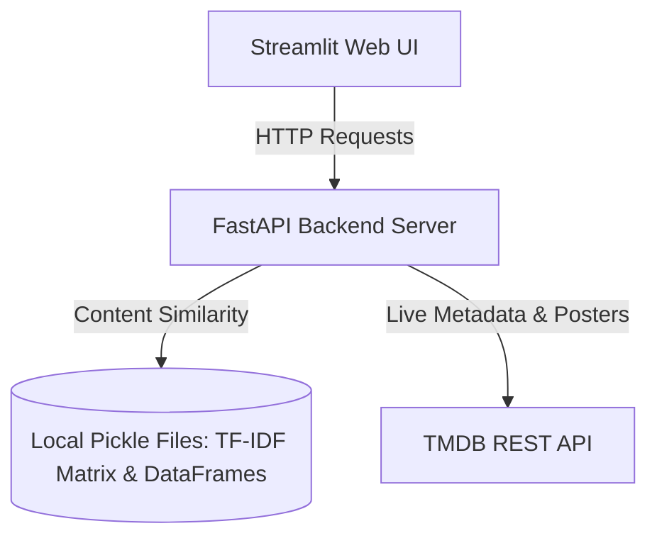

# 🎬 Hybrid Movie Recommendation System

An end-to-end hybrid movie recommendation application that combines **content-based filtering** with **dynamic TMDB integration**. 

The system utilizes a local pre-processed dataset for textual content similarity (TF-IDF and Cosine Similarity) and integrates with **The Movie Database (TMDB)** API to retrieve up-to-date movie metadata, genres, search autocomplete recommendations, and high-quality posters.

---

## 🚀 Key Features

*   **Hybrid Recommendation Engine:**
    *   **Content-Based Filtering:** Recommends similar movies using TF-IDF feature extraction and cosine similarity computed over local metadata (overviews, keywords, etc.).
    *   **Genre-Based Discovery:** Fetches top-performing movies under identical genres dynamically.
*   **Intuitive Autocomplete Search:** Suggests matching movie titles in real-time as you type, pulling direct matches from the search index.
*   **Interactive Movie Feed:** Display popular, trending, top-rated, now playing, and upcoming movies directly on the homepage.
*   **Detailed Information Cards:** View movie synopsis, genres, release date, ratings, and backdrop images in a responsive grid layout.

---

## 🛠️ Architecture

The application is structured into two main decoupled components:



### 1. Backend: FastAPI (`main.py`)
Exposes highly optimized endpoints for frontend consumption. It handles:
*   Loading and querying serialized datasets (using Pandas and Scipy).
*   Retrieving live listings and details from the TMDB API.
*   Combining content-based filtering recommendations with TMDB genre-based discovery in a single unified response bundle.

### 2. Frontend: Streamlit (`app.py`)
Provides a responsive user interface with:
*   State-driven views (Home vs. Movie Details).
*   A side-navigation control panel to change feed categories and grid column sizes.
*   Custom CSS styling for a cleaner modern look.

---

## 📂 Project Structure

```text
├── main.py                 # FastAPI backend entrypoint & router
├── app.py                  # Streamlit frontend client & interface
├── requirement.txt         # Python dependencies
├── runtime.txt             # Python runtime specification
├── .python-version         # Python version configuration
├── movie.ipynb             # Jupyter Notebook for data analysis, cleaning, and model exports
├── movies_metadata.csv     # Raw movie metadata dataset
├── df.pkl                  # Serialized pandas DataFrame with cleaned movie details
├── indices.pkl             # Serialized title-to-index mapping dictionary
├── tfidf.pkl               # Serialized TF-IDF Vectorizer configuration
└── tfidf_matrix.pkl        # Serialized scipy sparse matrix of TF-IDF vectors
```

---

## ⚙️ Setup & Installation

### Prerequisites
*   Python `3.12.0` (as defined in `runtime.txt`)
*   A TMDB API Key (you can request one from [The Movie Database](https://www.themoviedb.org/))

### 1. Clone the Repository
```bash
git clone <repository-url>
cd movie-recommendation-system
```

### 2. Set Up Virtual Environment
Create and activate a virtual environment:
```bash
# On Windows (PowerShell)
python -m venv .venv
.venv\Scripts\Activate.ps1

# On macOS/Linux
python -m venv .venv
source .venv/bin/activate
```

### 3. Install Dependencies
```bash
pip install -r requirement.txt
```

### 4. Configure Environment Variables
Create a file named `.env` in the root directory:
```env
TMDB_API_KEY=your_tmdb_api_key_here
```
> [!IMPORTANT]
> Do not commit your `.env` file to version control. It is already ignored by the default `.gitignore`.

---

## 🚦 How to Run

### Step 1: Start the Backend (FastAPI)
Launch the FastAPI development server:
```bash
uvicorn main:app --reload
```
By default, the API will be available at `http://localhost:8000`. You can access interactive documentation at `http://localhost:8000/docs`.

### Step 2: Start the Frontend (Streamlit)
Open a new terminal window/tab, activate the virtual environment, and launch the frontend client:
```bash
streamlit run app.py
```
Streamlit will launch in your default web browser (typically at `http://localhost:8501`).

---

## 🌐 Deployment

The application is deployed and hosted in a cloud environment:

*   **Backend (API):** Deployed as a web service on **Render**. The API endpoints are securely routed, and the TMDB API key is kept safe via Render's environment variables. No private API keys or Render access credentials are saved in the source files.
*   **Frontend (UI):** Hosted on **Streamlit Community Cloud**. You can access the live application here:
    👉 **[Live App Link](https://movie-recommendation-system-254kcrn3wkux3hzdbfcjrb.streamlit.app/)**

---

## 🔌 API Documentation

| Endpoint | Method | Description |
| :--- | :--- | :--- |
| `/health` | `GET` | Verifies service status. |
| `/home` | `GET` | Fetches dynamic home feed movies (supports: `trending`, `popular`, `top_rated`, `upcoming`, `now_playing`). |
| `/tmdb/search` | `GET` | Fuzzy queries TMDB for movies matching a search query. |
| `/movie/id/{tmdb_id}`| `GET` | Retrieves full details (overview, genres, poster/backdrop urls) for a movie ID. |
| `/recommend/genre` | `GET` | Fetches movies matching the genre of the input movie. |
| `/recommend/tfidf` | `GET` | Fetches content-based similarity suggestions from the local pickle data. |
| `/movie/search` | `GET` | Bundled search endpoint returning detailed movie info, TF-IDF content recommendations, and genre matches in a single network trip. |
